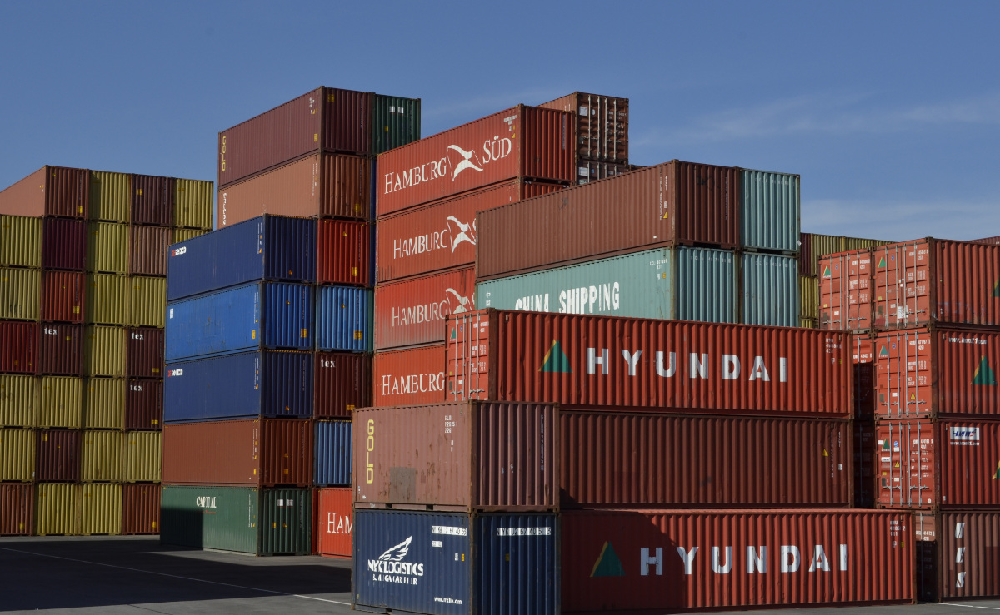

# O que é um Contêiner?
> É uma abstração na camada do aplicativo que agrupa o código e as dependências. Vários contêineres podem ser executados na mesma máquina e **compartilhar o kernel do sistema operacional** com outros contêineres, cada um executando como **processos isolados** no espaço do usuário.

> É um tipo de virtualização no nível do sistema operacional que permite empacotar o código e todas as suas dependências, na forma de uma unidade padrão de software onde o aplicativo seja executado de forma rápida e confiável de um ambiente para outro

# Dependency hell e famoso "No meu notebook funciona!"
O empacotamento de código e dependências numa mesma unidade fácil de transportar evita o "Inferno das Dependências" em que o código fica acoplado ao ambiente de desenvolvimento e ao ser provisionado em outros ambientes( produção ou homolog) ele quebra.

# E Docker?

O Docker surge em 2013 com a implementamentação de um *runtime* chamado [Docker Engine](https://www.docker.com/products/container-runtime) que, além de opensource, trouxe facilidades tanto para os setores de desenvolvimento(DEVs) quanto para os setores de operações(OPs).

Atualmente o Docker roda sobre o *runtime* chamado **containerd**, criado pela empresa Docker mas que hoje é suportado pela *[CNCF - Cloud Native Computing Foundation](https://www.cncf.io/)* o quê garante compatibilidade com diversas plataformas de conteinerização.

A simplicidade do docker fez popularizar a tecnologia de contêiner que hoje tem opção independentes de docker tais como o próprio containerd, o pocman, CRI-O, entre outras.

# Contêiner _versus_ Máquina Virtual (VM)
Vários contêineres podem ser executados na mesma máquina e compartilhar o kernel do sistema operacional com outros contêineres, cada um executando como processos isolados no espaço do usuário. Isso tudo ocupando alguns poucos megabytes de disco.

Já as máquinas virtuais (VMs) são uma abstração do próprio hardware físico do servidor, a virtulização tradicional transforma um servidor físico em vários servidores virtuais. A camada do hipervisor permite que várias VMs sejam executadas em uma única máquina. 

Como cada VM inclui uma cópia completa do sistema operacional, o aplicativo, os binários e as bibliotecas necessários, ocupa dezenas de gigabytes.

# Referências

[Docker - site oficial](https://docker.com)

[Pagar.me Talks #3.1 - Docker: nivelando conhecimento](https://www.youtube.com/watch?v=hCMcQfGb4cA)

[Descomplicando o Docker](https://github.com/badtuxx/DescomplicandoDocker)